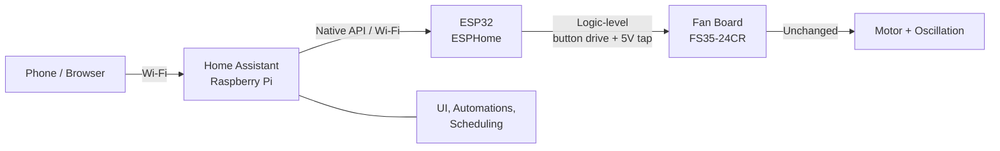
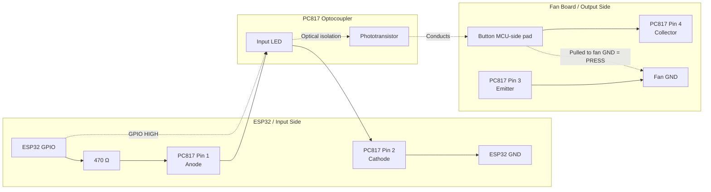

# Architecture — Smart Fan Retrofit (Philips CX2550/00)


## 1. Design principle

The fan's board (`FS35-24CR`) is MCU-driven: buttons are logic inputs and a 5 V
rail powers its MCU. The retrofit interfaces **only at logic level** — an ESP32
running ESPHome electronically presses the four buttons via optocouplers and draws
power from the board's 5 V rail. No mains wiring is touched; the physical buttons
still work; the whole mod is reversible.

Control is **open-loop**: the ESP32 does not read the fan's LEDs. It maintains an
internal model of the fan's state and infers the board's awake/asleep condition
from its own activity timer.

## 2. System context




- User interacts only with Home Assistant; HA ↔ ESP32 over the native ESPHome API
  (no MQTT). All local; no cloud.
- If Pi/HA is offline, the fan still works via its physical buttons.

## 3. The two physical tap points (open-loop → only two, not three)

### 3.1 Buttons (ESP32 → fan): "press" via PC817
A tactile button's MCU-side node sits at ~5 V (pull-up); pressing shorts it to
GND, read as a press. The ESP32 reproduces that short with a PC817 output
transistor, isolated from the fan board.


- 4 channels: `SW71`, `SW72`, `SW73`, `SW74`.
- Wired in parallel with each physical button → physical buttons still work.
- Collector-high/emitter-low satisfied because the node sits above GND.

### 3.2 Power (fan → ESP32)
```
   Centre electrolytic cap (+leg) ──► ESP32 5V / VIN
   Cap stripe (−) leg  (or CN3 GND) ──► ESP32 GND
   (optional 470µF across 5V/GND for Wi-Fi spikes)
```

> Ground note: the power tap shares ground with the fan board on the ESP32 side
> (expected). The PC817s keep the button *signal* paths isolated, protecting both
> sides from wiring slips.

## 4. Complete wiring map

```mermaid
 ESP32 (socketed) + 4×PC817 + 4×330Ω on perfboard        Fan board (low-voltage side)
 ─────────────────────────────────────────────────       ───────────────────────────
 GPIO_SW71 ─[330Ω]─►PC817#1► collector ──────────────────► SW71 MCU-side pad
 GPIO_SW72 ─[330Ω]─►PC817#2► collector ──────────────────► SW72 MCU-side pad
 GPIO_SW73 ─[330Ω]─►PC817#3► collector ──────────────────► SW73 MCU-side pad
 GPIO_SW74 ─[330Ω]─►PC817#4► collector ──────────────────► SW74 MCU-side pad
 (all PC817 emitters) ───────────────────────────────────► fan GND
 (all PC817 cathodes) ── ESP32 GND

 ESP32 5V/VIN ◄────────────── power ─────────────────────  centre cap +leg (5V)
 ESP32 GND    ◄───────────────────────────────────────────  cap stripe leg / CN3 GND
```
- ~7 wires total: 4 button signals, 1 fan-GND (shared by emitters), 2 power.
- All land on a **screw terminal block**; ESP32 plugs into female headers.

## 5. GPIO planning (AZ-Delivery ESP32-S DevKit C V4 = classic ESP32)

Outputs only (no sensing). Avoid strapping pins for reliability.

| Function | GPIO (suggested) | Notes |
| --- | --- | --- |
| Press `SW71` (power) | GPIO32 | output |
| Press `SW72` (speed/mode) | GPIO25 | output |
| Press `SW73` (oscillation) | GPIO27 | output |
| Press `SW74` (timer) | GPIO14 | output (optional use) |

Final pins confirmed at build time; any safe output GPIO works.

## 6. ESPHome logical model (entities exposed to HA)

| Entity | Type | Backed by | Behaviour |
| --- | --- | --- | --- |
| Fan power | `switch` (or `fan`) | press `SW71` | on/off via model + awake/asleep logic |
| Fan mode | `select` (5 options) | press `SW72` ×N | targets one of speed1/2/3/sleep/natural in the 5-ring |
| Oscillation | `switch` | press `SW73` | on/off toggle; off = "stop where it is" |
| Timer | HA automation | (HA) | delayed on/off; `SW74` optional |

Each **press** is a momentary pulse: opto channel ON → hold ~pulse-width →
OFF. Implemented as ESPHome outputs/actions (design only; no code here).

## 7. Strategy C — open-loop state model + awake/asleep inference

### 7.1 State the ESP32 keeps
- `power_on` (bool) — assumed on/off
- `mode` (enum: speed1/speed2/speed3/sleep/natural)
- `oscillating` (bool)
- `t_idle` — time since the ESP32's last button press (ms)

### 7.2 Awake/asleep inference (no sensing)
- `t_idle < WAKE_THRESHOLD` (5 s if (fan mode == sleep); 60 s otherwise) → board assumed **awake** → 1 press acts.
- `t_idle ≥ WAKE_THRESHOLD` → board assumed **asleep** → first press only wakes;
  a wake press must be prepended before any acting press.
- **Every** button press resets `t_idle = 0` (any press re-lights LEDs).
- Applies to all four buttons (confirmed universal wake behaviour).

### 7.3 Boot behaviour (passive default — chosen)
- On boot the ESP32 presses **nothing**.
- It retains the model state as previous just like the fan would behave.
- The first real user command syncs intent. No spurious toggling at boot
  (e.g. after a power blip). Model may be wrong until the first command — accepted.

### 7.4 Accepted limitations
- Human use of physical buttons drifts the model until the next HA command.
- The `WAKE_THRESHOLD` inference can misfire at the boundary or under human
  interference; effect self-corrects on the next command. Recovery: re-issue the
  command, or toggle power via HA to re-establish.

## 8. Command algorithms (design; detailed in firmware plan)

All acting sequences first apply the **wake rule**: if `t_idle ≥ WAKE_THRESHOLD`,
prepend one wake press (which performs no action), then continue.

- **Power:** wake-if-needed → 1 press `SW71` → flip `power_on`.
- **Mode:** wake-if-needed → compute forward steps in ring
  `speed1→speed2→speed3→sleep→natural→speed1` from `mode` to target → that many
  `SW72` presses → set `mode`. 
- **Oscillation:** wake-if-needed → 1 press `SW73` → flip `oscillating`.
- **Timer:** handled by HA automation (delayed power command). Optional native
  path: wake-if-needed → cycle `SW74` to target.

## 9. Assembly & isolation summary
- Button signal paths optically isolated (PC817). Power path shares ground on the
  ESP32 side (expected).
- All ESP32-side parts on a small perfboard; single screw-terminal disconnect to
  the fan-board taps.
- 30 AWG taps strain-relieved with hot glue near each joint.
- ESP32 socketed on female headers; assembly secured inside the fan base, clear of
  the mains corner (`ACL/ACN/FUSE21`).

## 10. Build & bring-up order
1. Probe/confirm (done): 5 V rail, ground continuity, button GND pads.
2. Bench the ESP32 on USB: flash ESPHome, join Wi-Fi, appears in HA.
3. Build perfboard: 4× PC817 + 4× 330 Ω + socket + terminal.
4. Solder taps to `SW71`–`SW74` MCU-side pads + fan GND; strain-relieve.
5. Configure ESPHome entities + Strategy C logic (per firmware plan).
6. Verify in HA: power, 5-way mode select, oscillation, timer automation.
7. Cut ESP32 power over to the fan 5 V rail; reassemble.

