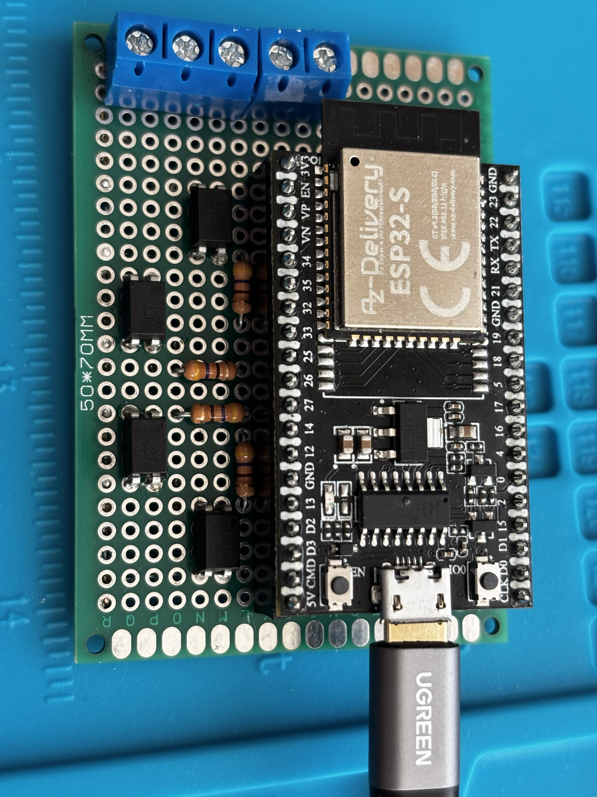
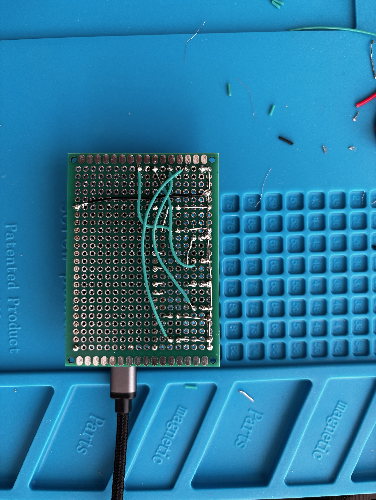
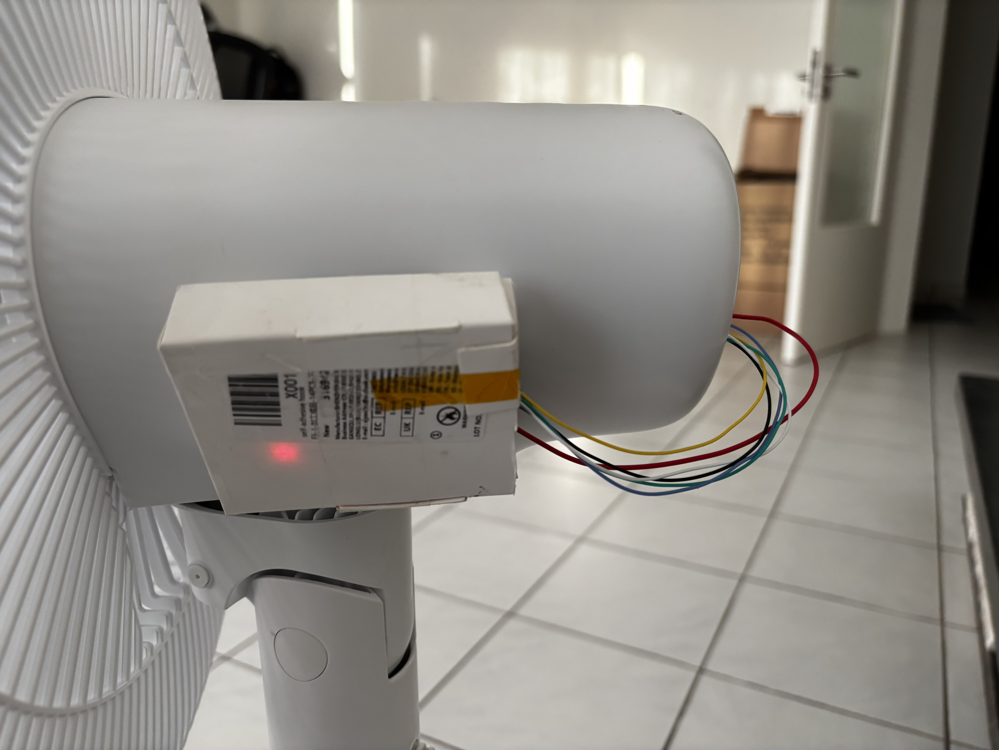

# Smart Fan Retrofit - Philips 2000 Series (CX2550/00)

Retrofitting a Philips CX2550/00 pedestal fan for control via Home Assistant,
without modifying the fan's mains wiring. An ESP32 running ESPHome electronically
"presses" the fan's existing buttons through optocouplers, and Home Assistant
provides the control dashboard over the native ESPHome API.

The fan's physical buttons remain fully functional - the retrofit is entirely
additive and reversible.

## Photos

**Interface board - front**

**Interface board - back**

**Installed in the fan**

## How it works

The fan's control board (`FS35-24CR`) is already microcontroller-driven ; its
four buttons are logic-level inputs, not mains switches. This retrofit adds an
ESP32 alongside it that:

- **Presses buttons** : a PC817 optocoupler per button, driven by an ESP32 GPIO,
  shorts the button's signal pad to ground exactly as a finger-press would.
  Wired in parallel with the physical buttons, which keep working normally.
- **Draws power** from the fan board's own onboard 5V rail (no separate supply
  needed once installed).
- **Talks to Home Assistant** over the native ESPHome API ; no custom app, no
  cloud, all on the local network.

Because there is no feedback from the fan back to the ESP32 (its indicator LEDs
turned out to be a low-voltage, multiplexed signal that wasn't practical to read),
control is **open-loop**: the ESP32 tracks the fan's state internally rather than
sensing it directly.

## Current status

Implemented and tested up to:

- **Power on/off**
- **Speed / mode select** : 5-position cycle (Speed 1, Speed 2, Speed 3, Sleep,
  Natural wind), with the ESP32 computing how many button presses are needed to
  reach the selected mode
- **Oscillation on/off** : turning oscillation off freezes the fan head at its
  current angle

Not yet implemented: sleep timer control (not currently being pursued; the
plan is to use a Home Assistant automation for this rather than the fan's
native timer button).

## Hardware

| Part | Notes |
| --- | --- |
| ESP32 | AZ-Delivery ESP32-S DevKit C V4 (classic ESP32-WROOM-32) |
| Optocouplers | 4× Sharp PC817, one per fan button |
| Power | Tapped from the fan board's onboard 5V rail |
| Interface board | Small perfboard hosting the ESP32 socket, optocouplers, and a screw terminal to the fan-board taps |

Note: the fan's buttons only respond to a single press if the
board is "awake" (its indicators recently lit). After roughly a minute of
inactivity the board goes to sleep, and the first press on any button only
wakes it — a second press is needed to actually act. The firmware accounts for
this automatically.

## Software

Firmware is written in [ESPHome](https://esphome.io/) and controlled through
[Home Assistant](https://www.home-assistant.io/) over the native API ; no
custom app or PWA. See the project documentation for the full requirements,
architecture, and staged firmware build-up used to develop and test this.

## Known limitations

- Open-loop control: the firmware's model of the fan's state can drift if the
  physical buttons are used directly. This self-corrects on the next command
  sent from Home Assistant.
- No mains wiring is modified anywhere in this project - all ESP32 connections
  are at logic level (buttons and the low-voltage rail).
